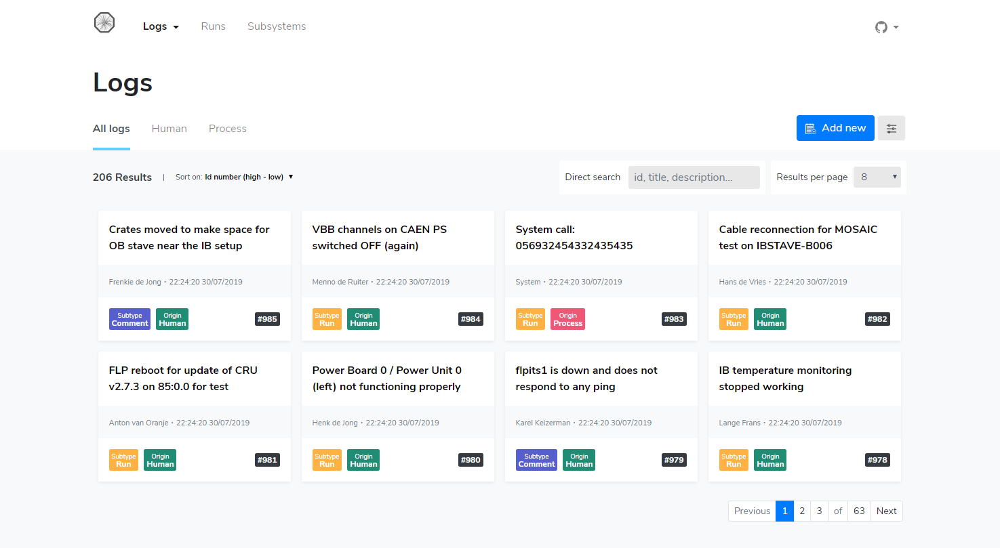
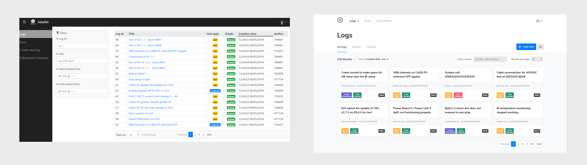
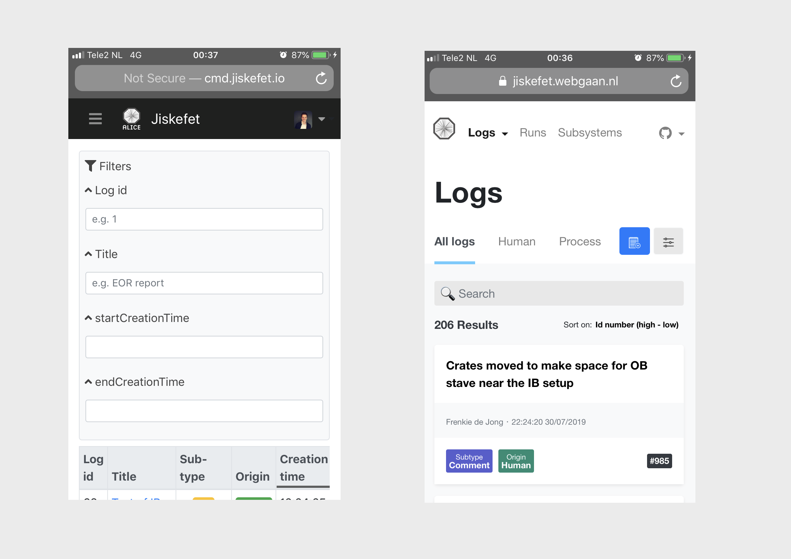

<h1 align="center">Project 3 @cmda-minor-web 1819</h1>

<b>AS a user, I WANT to be able to use Jiskefet web application on all my devices
SO I can search through all stored metadata.
</b>

 

  

 

 

 

<!-- ☝️ replace this description with a description of your own work -->
## Introduction
A reponsive redesign of the Jiskefet web application has been made as part of a course from [@cmda-minor-web 18-19](https://github.com/cmda-minor-web/project-3-1819).

Some resources possess an emoticon to help you understand which type of content you may find:

- 📖: Documentation or article
- 🛠: Tool, code or library
- 📹: Video

<!-- Maybe a table of contents here? 📚 -->
## Table of Contents

- [Redesign](#learning-process)
  - [Comparison](#comparison)
    - [Desktop](#desktop)
    - [Mobile](#mobile)
  - [Changes](#changes)
- [Sources](#sources)

<!-- How about a section that describes how to install this project? 🤓 -->
## Redesign
A new application is being build for Cern, called Jiskefet. It stores a lot of logs that are being created by a system at Cern or by human input. the current design is made by back-end developers; meaning the design didn't get the attention it deserves.

### Comparison
The easiest way to notice the changes I made is by comparing the current design with the new redesign. I only show the initial load of the screen (without scrolling). The current design is on the left, and the redesign is on the right.

#### Desktop
I removed the "Hamburger" slide in menu as it's not necessary to hide the menu. Hiding a menu is often bad design. I shortened the names inside the menu to be able to fit the menu on mobile phones without hiding it in a "hamburger". I also removed the "Create new log" from the menu. It doesn't make sense for it to be there; I implemented the option to create a new log by pressing the button called "Add log" on the logs page. I also implemented the "Add log" as a dropdown option in the header menu under the "Logs" page. Both options will open a modal with the form, instead of redirecting to a different page.

The form to filter the results have been removed. Filtering is now done on a more efficient way, by using a tab menu or by direct search (one input field in which you can search for multiple things: id, title and description). Since filtering on timings take a lot of space and because those filter options are not always important, I added a "filter" button on the right side next to the "Add log" button. It will slide open a form on the right side of the screen.

The most noticable difference is that I changed the design for the logs from tables to a grid; for responsive reasons, though tables aren't necessarely bad (on desktop). Something that would be a nice add-on is to make the user choose between a grid version or a table version, on desktop. You remove this option on mobile, it's always grid on mobile.

Above is a quick summary of some changes that I made, which required some explanation. There are more changes, I created a list of all changes I implemented down below in the chapter called Changes.

#### Mobile 
As you can see, the form is taking up the entire space of the initial screen load in the current design. This is fixed by removing the form and filtering on different ways.

### Changes
 * Added the main navigation to the header top bar
 * Removed "create new log" from menu and implemented as a "dropdown" option in the header menu under "logs"
 * Shortened menu names
 * Removed the hamburger menu button
 * Change of color palette (from dark to light)
 * Added page title heading
 * Removed the filter form
 * Added tab menu for quick filtering (on all, human and process logs)
 * Added button to add a new log
 * Added filter button to filter on all timings (form will slide in from the right side on click)
 * Added amount of results
 * Added sorting option
 * Added direct search (on title, id or description)
 * Moved option to change results per page to the top of the results
 * Changed design from tables to grid
 * Changed author id to actual name
 * Made it reponsive ;-)

<!-- Maybe a checklist of done stuff and stuff still on your wishlist? ✅ -->
## Wishlist
- [ ] Redesign all pages

<!-- Maybe I used some awesome sources that I can mention 🤔-->
## Sources
Underneath you will find all the sources that were previously mentioned throughout the document and some others which were helpful.

> * 🛠 [Jiskefet](http://cmd.jiskefet.io)
> * 📖 [Cern](https://home.cern/)
> * 🛠 + 📖 [Bootstrap](https://getbootstrap.com/docs/4.3/getting-started/introduction/)
